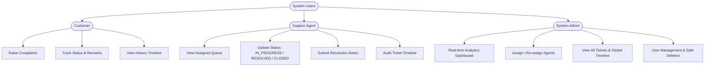
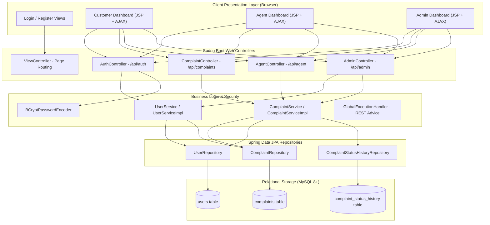
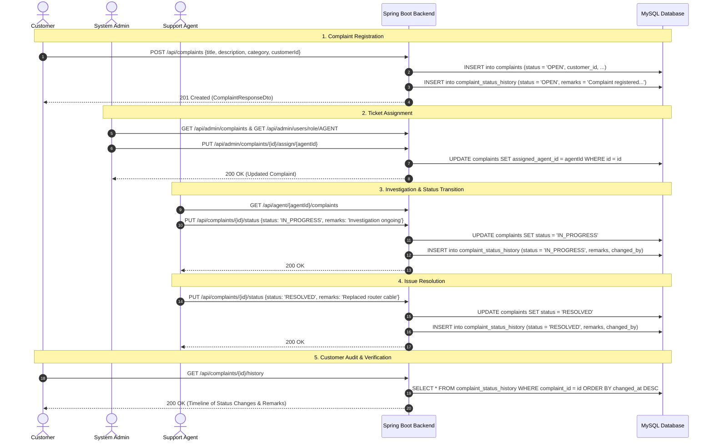
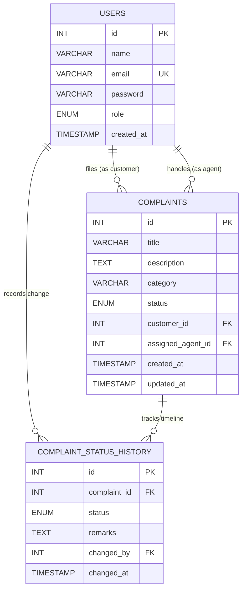

# Product Requirements Document (PRD)
## Smart Complaint & Service Management Portal

---

### Document Metadata
- **Product Name:** Smart Complaint & Service Management Portal
- **Document Version:** 1.0.0
- **Status:** Approved / Production-Ready
- **Target Audience:** Engineering Team, Product Managers, QA Engineers, Support Operations

---

## 1. Executive Summary
The **Smart Complaint & Service Management Portal** is an enterprise-grade web application designed to streamline the lifecycle of service issues, customer grievances, and technical support requests. It bridges the communication gap between customers raising complaints, support agents investigating and resolving issues, and system administrators overseeing performance, assignments, and account governance.

The system is architected around a layered Spring Boot MVC backend, Spring Data JPA / Hibernate persistence layer, MySQL relational database, and an asynchronous JSP + AJAX frontend styled with a modern design system.

---

## 2. Problem Statement & Business Objectives
### 2.1 Problem Statement
- Organizations face high operational overhead and customer dissatisfaction due to scattered email/phone complaints, lack of accountability in ticket assignments, and absence of an audit trail for status changes.
- Support agents often lack centralized tools to track their assigned work queue and log diagnostic remarks.
- Management lacks real-time visibility into overall complaint resolution metrics and role-based operational bottlenecks.

### 2.2 Business Objectives
1. **Centralize Complaint Ingestion:** Provide a single portal for customers across multiple categories (Broadband, Billing, Hardware, General).
2. **Accountability & Tracking:** Ensure each complaint has an immutable history audit log tracking timestamp, updater, previous state, new state, and resolution notes.
3. **Role-Based Access Control (RBAC):** Restrict capabilities according to 3 discrete roles: `CUSTOMER`, `AGENT`, and `ADMIN`.
4. **Data Integrity & Safe Operations:** Enforce strict business constraints (e.g. preventing the deletion of users tied to unresolved tickets).

---

## 3. User Personas & Roles

### 3.1 Customer Persona
- **Goal:** File service complaints quickly, categorize them, and track progress until resolution.
- **Pain Points:** Lack of updates, not knowing which agent is handling the problem, opaque resolution notes.

### 3.2 Support Agent Persona
- **Goal:** View personal queue of assigned complaints, transition status smoothly from `OPEN` to `IN_PROGRESS` and `RESOLVED`/`CLOSED`, and record diagnostic remarks.
- **Pain Points:** Unclear assignment priorities, cluttered interfaces.

### 3.3 System Administrator Persona
- **Goal:** Monitor system-wide KPIs (total complaints, distribution by status, role metrics), assign unassigned complaints to active agents, and manage user accounts safely.
- **Pain Points:** Unassigned tickets falling through the cracks, accidentally deleting agents or customers with active tickets.

---

## 4. System Architecture & Flow

### 4.1 High-Level Architecture

### 4.2 End-to-End Complaint Lifecycle Flow

---

## 5. Functional Specifications

### 5.1 Authentication & Role Authorization (`/api/auth`)
- **Registration (`POST /api/auth/register`):**
  - Inputs: `name` (max 100), `email` (valid email, max 100), `password` (min 6 chars), `role` (`CUSTOMER`, `AGENT`, `ADMIN`).
  - Business Rules: Email must be unique. Password is encrypted using `BCryptPasswordEncoder` before saving.
  - Responses: `201 Created` with `UserResponseDto` (excludes password); `409 Conflict` if email already exists; `400 Bad Request` if validation fails.
- **Login (`POST /api/auth/login`):**
  - Inputs: `email`, `password`.
  - Business Rules: Validates credentials via BCrypt matching against database hash.
  - Responses: `200 OK` with user details and redirect target; `401 Unauthorized` on invalid credentials.

### 5.2 Complaint Management (`/api/complaints`)
- **Create Complaint (`POST /api/complaints`):**
  - Auto-initializes complaint status to `OPEN`.
  - Automatically writes initial entry into `complaint_status_history` table.
- **Get Complaint by ID (`GET /api/complaints/{id}`):** Returns single complaint details.
- **Get Customer Complaints (`GET /api/complaints/customer/{customerId}`):** Returns all complaints submitted by the customer.
- **Get Agent Complaints (`GET /api/complaints/agent/{agentId}`):** Returns all complaints assigned to the agent.
- **Get Complaint History (`GET /api/complaints/{id}/history`):** Returns ordered chronological history audit log.
- **Update Complaint Status (`PUT /api/complaints/{id}/status`):** Updates status to `IN_PROGRESS`, `RESOLVED`, or `CLOSED` and appends remark to history log.

### 5.3 Support Agent Operations (`/api/agent`)
- **Assigned Queue (`GET /api/agent/{agentId}/complaints`):** Returns complaints assigned to specific agent.
- **Resolve Complaint (`PUT /api/agent/{agentId}/complaints/{complaintId}/resolve`):** Directly sets status to `RESOLVED` with mandatory remarks.
- **Audit Timeline (`GET /api/agent/{agentId}/complaints/{complaintId}/history`):** Fetches complete historical trail.

### 5.4 Administrator Control (`/api/admin`)
- **Dashboard Stats (`GET /api/admin/dashboard/stats`):** Aggregate counts of total complaints, breakdown by status, and breakdown by user roles.
- **All Complaints (`GET /api/admin/complaints`):** Lists all registered complaints in the platform.
- **Assign Agent (`PUT /api/admin/complaints/{complaintId}/assign/{agentId}`):** Assigns or reassigns an agent to a complaint.
- **User Directory (`GET /api/admin/users`):** Lists all registered users with metadata (no password hashes exposed).
- **Users by Role (`GET /api/admin/users/role/{role}`):** Filters user list by specific role.
- **Safe User Deletion (`DELETE /api/admin/users/{userId}`):**
  - Business Rule: Prevents deletion if the customer has unresolved tickets (`OPEN` or `IN_PROGRESS`), or if the agent is assigned to unresolved tickets. Returns `400 Bad Request` with descriptive message if blocked.

---

## 6. Data Model & Database Schema

### 6.1 Entity-Relationship (ER) Diagram

### 6.2 State Transition Matrix

| Initial State | Allowed New State | Triggered By | History Log Created? |
|---|---|---|---|
| *(None)* | `OPEN` | Customer Registration | Yes ("Complaint registered successfully") |
| `OPEN` | `IN_PROGRESS` | Agent / Admin | Yes (with custom remarks) |
| `IN_PROGRESS` | `RESOLVED` | Agent / Admin | Yes (with resolution remarks) |
| `RESOLVED` | `CLOSED` | Agent / Admin / Customer | Yes (with closing notes) |
| `RESOLVED` | `IN_PROGRESS` | Agent / Admin | Yes (with re-opening remarks) |

---

## 7. Non-Functional Requirements (NFR)

1. **Security:**
   - Passwords encoded with industry standard BCrypt with work factor 10.
   - Passwords omitted from all JSON DTO responses.
   - Validation constraints enforced via Jakarta Bean Validation (`@Valid`, `@NotBlank`, `@Email`, `@Size`, `@NotNull`).
2. **Reliability & Data Integrity:**
   - Spring Transaction Management (`@Transactional`) ensures atomic state and history persistence.
   - Foreign key constraints with appropriate `ON DELETE` rules (`CASCADE` for history, `SET NULL` for assigned agent).
3. **Usability & Design:**
   - Fully responsive design compatible with Desktop (1920x1080), Laptop (1366x768), Tablet (768px), and Mobile (<600px).
   - Real-time client-side search and filtering for complaints and users.
   - Visual feedback through status badges and interactive audit modals.
4. **Performance:**
   - Database indexes created on `email`, `customer_id`, `assigned_agent_id`, `complaint_id`, and `changed_by`.

---

## 8. Verification & Acceptance Criteria
- [x] All 30 automated unit and MockMvc controller tests pass without failure.
- [x] Database configuration (`application.properties`) connects to MySQL and boots cleanly.
- [x] JSP view resolver maps `/WEB-INF/jsp/*.jsp` correctly.
- [x] Customer can register, log in, submit complaint, and view status history timeline.
- [x] Agent can log in, view assigned complaints, update status with remarks, and resolve issues.
- [x] Admin can view real-time statistics, assign agents, view all complaints, and manage user accounts safely.
- [x] Global exception handler translates errors into standardized JSON structures with correct HTTP status codes (400, 404, 409, 500).
