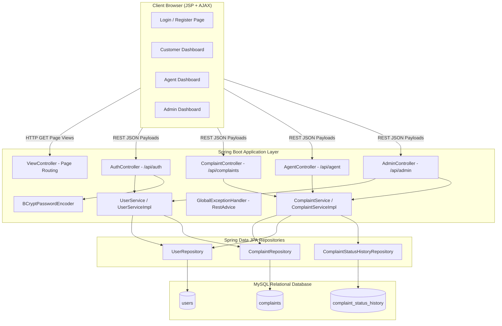
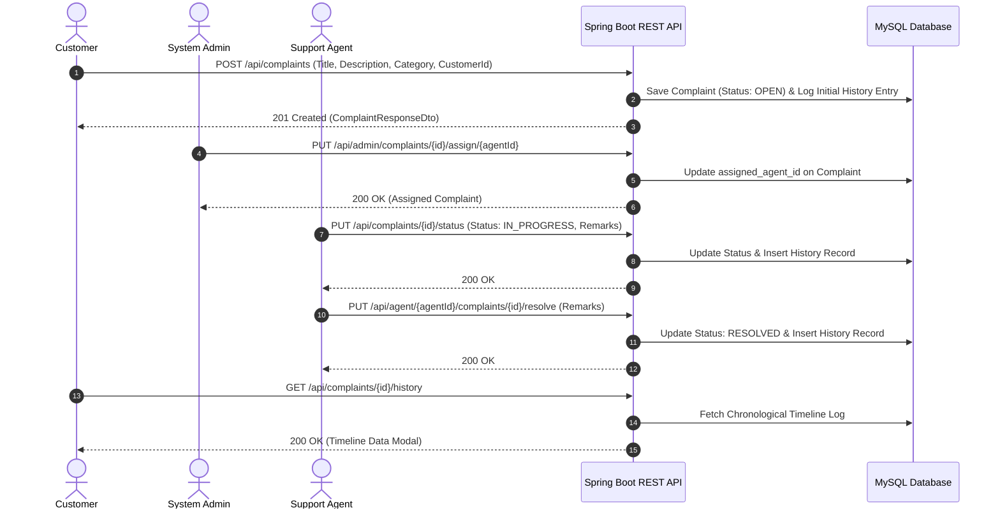
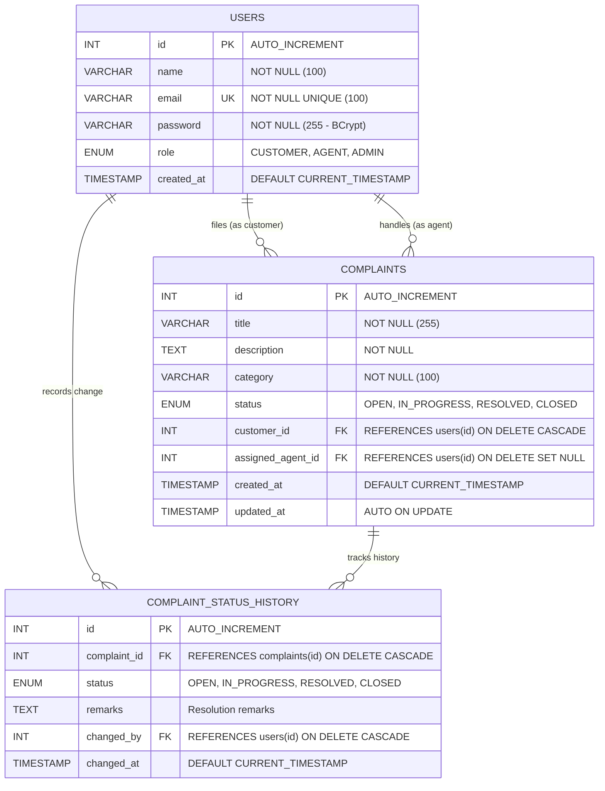

# Smart Complaint & Service Management Portal

[](https://spring.io/projects/spring-boot)
[](https://www.oracle.com/java/)
[](https://www.mysql.com/)
[](LICENSE)
[]()

An enterprise-grade, full-stack Spring Boot complaint and service management web application designed to log, manage, assign, track, and resolve customer complaints with real-time analytics, automated audit trail history logging, role-based access control (RBAC), and responsive JSP + AJAX user interfaces.

---

## 📑 Table of Contents
1. [Key Features](#-key-features)
2. [Technology Stack & Skills Used](#-technology-stack--skills-used)
3. [Architecture & System Flow](#-architecture--system-flow)
4. [Database Schema & ER Model](#-database-schema--er-model)
5. [Setup & Installation](#-setup--installation)
6. [API Reference](#-api-reference)
7. [User Roles & Permissions](#-user-roles--permissions)
8. [Testing & Quality Assurance](#-testing--quality-assurance)
9. [Project Directory Structure](#-project-directory-structure)

---

## 🌟 Key Features

- **Role-Based Portals:** Dedicated, intuitive interfaces for **Customers**, **Support Agents**, and **System Administrators**.
- **Complete Complaint Lifecycle Management:** Real-time state transitions across `OPEN` ➔ `IN_PROGRESS` ➔ `RESOLVED` ➔ `CLOSED`.
- **Automated Audit Trail Logging:** Every status change and remark is recorded with timestamp and user attribution in `complaint_status_history`.
- **Interactive Audit Timeline Modal:** Customers, agents, and administrators can inspect the complete timeline and diagnostic notes on any ticket.
- **Real-Time Analytics Dashboard:** Instant counters for Total Complaints, Open, In Progress, and Resolved tickets.
- **Dynamic Filtering & Live Search:** Client-side filtering by query, category, and status.
- **Enterprise Security:** Cryptographic password hashing using `BCryptPasswordEncoder` (strength 10), DTO data abstraction, and input validation.
- **Safe Data Operations:** Integrity constraints prevent deleting users who are associated with unresolved tickets.
- **Global Error Handling:** Standardized error envelopes with appropriate HTTP status codes (400, 401, 404, 409, 500).

---

## 🛠️ Technology Stack & Skills Used

| Category | Technology / Library | Purpose |
|---|---|---|
| **Backend Language** | Java 17 (LTS) | Core object-oriented business logic, records, and streams |
| **Backend Framework** | Spring Boot 3.3.2 | Rapid application framework, dependency injection, and REST controllers |
| **Data Persistence** | Spring Data JPA / Hibernate | ORM mapping, automated queries, `@CreationTimestamp`, `@UpdateTimestamp`, transactions |
| **Database** | MySQL 8.0+ | Relational schema, foreign keys, indexes, cascades |
| **Security** | Spring Security Crypto | Industry-standard BCrypt one-way password hashing |
| **Validation** | Jakarta Bean Validation (Hibernate Validator) | Strong validation rules (`@Valid`, `@NotBlank`, `@Email`, `@Size`, `@NotNull`) |
| **Frontend & Templating** | JSP (JavaServer Pages) & JSTL | Dynamic server-side page rendering (`tomcat-embed-jasper`) |
| **Client Scripting** | Modern JavaScript (ES6+ / Fetch API) | Asynchronous AJAX communication, DOM manipulation, session state management |
| **Styling & Design System** | Modern Vanilla CSS & Google Inter Font | Glassmorphism, responsive grid/flexbox, badges, timeline animations |
| **Testing Framework** | JUnit 5, Mockito & MockMvc | Unit tests, mock isolation, Spring MVC controller integration testing |
| **Build & Dependency Tool** | Apache Maven 3.x | Build lifecycle, dependency management, and packaging |

---

## 🔄 Architecture & System Flow

### System Architecture Diagram



### End-to-End Execution Flow



---

## 🗄️ Database Schema & ER Model



---

## 🚀 Setup & Installation

### 1. Prerequisites
- **Java Development Kit (JDK):** Version 17 or higher (`java -version`)
- **Apache Maven:** Version 3.8+ (`mvn -version`)
- **MySQL Database Server:** Version 8.0+ running on `localhost:3306`

### 2. Database Initialization
1. Start MySQL server.
2. Open a MySQL terminal or workbench and execute:
   ```sql
   CREATE DATABASE IF NOT EXISTS complaint_portal;
   USE complaint_portal;
   ```
3. Run the schema and initial seed script located at [src/main/resources/schema.sql](file:///c:/Users/Nikhil/Documents/wipro_assignment/WiproProject_ComplaintPortal/src/main/resources/schema.sql):
   ```sql
   source src/main/resources/schema.sql;
   ```

### 3. Application Configuration
Ensure [src/main/resources/application.properties](file:///c:/Users/Nikhil/Documents/wipro_assignment/WiproProject_ComplaintPortal/src/main/resources/application.properties) matches your MySQL credentials:
```properties
server.port=8080

spring.datasource.url=jdbc:mysql://localhost:3306/complaint_portal?useSSL=false&serverTimezone=UTC&allowPublicKeyRetrieval=true
spring.datasource.username=root
spring.datasource.password=root
spring.datasource.driver-class-name=com.mysql.cj.jdbc.Driver

spring.mvc.view.prefix=/WEB-INF/jsp/
spring.mvc.view.suffix=.jsp
```

### 4. Build & Run
Run the Spring Boot application using Maven:
```bash
mvn clean spring-boot:run
```
Once started, access the portal in your browser:
👉 **[http://localhost:8080/](http://localhost:8080/)**

### 5. Default Seed Credentials

| Role | Email | Password |
|---|---|---|
| **Administrator** | `admin@complaintportal.com` | `password123` |
| **Support Agent** | `agent@complaintportal.com` | `password123` |
| **Customer** | `customer@complaintportal.com` | `password123` |

---

## 📍 API Reference

### 🔐 Authentication (`/api/auth`)
| Method | Endpoint | Description | Request Body |
|---|---|---|---|
| `POST` | `/api/auth/register` | Register a new user (`CUSTOMER`, `AGENT`, `ADMIN`) | `UserRegistrationDto` |
| `POST` | `/api/auth/login` | Authenticate user credentials and return role | `LoginRequestDto` |

### 📋 Complaints Management (`/api/complaints`)
| Method | Endpoint | Description | Request Body |
|---|---|---|---|
| `POST` | `/api/complaints` | Submit a new complaint | `ComplaintCreateDto` |
| `GET` | `/api/complaints/{id}` | Get complaint details by ID | None |
| `GET` | `/api/complaints/{id}/history` | Get complete status history timeline | None |
| `GET` | `/api/complaints/customer/{customerId}` | List all complaints filed by a customer | None |
| `GET` | `/api/complaints/agent/{agentId}` | List complaints assigned to an agent | None |
| `PUT` | `/api/complaints/{id}/status` | Update status (`IN_PROGRESS`/`RESOLVED`/`CLOSED`) with remarks | `StatusUpdateDto` |

### 🎧 Support Agent (`/api/agent`)
| Method | Endpoint | Description | Request Body |
|---|---|---|---|
| `GET` | `/api/agent/{agentId}/complaints` | List complaints assigned to specific agent | None |
| `PUT` | `/api/agent/{agentId}/complaints/{complaintId}/resolve` | Resolve a complaint with resolution remarks | `ResolveRequestDto` |
| `GET` | `/api/agent/{agentId}/complaints/{complaintId}/history` | Get audit timeline for assigned complaint | None |

### 👑 System Administrator (`/api/admin`)
| Method | Endpoint | Description | Request Body |
|---|---|---|---|
| `GET` | `/api/admin/dashboard/stats` | Aggregate dashboard KPI metrics | None |
| `GET` | `/api/admin/complaints` | List all registered complaints | None |
| `PUT` | `/api/admin/complaints/{complaintId}/assign/{agentId}` | Assign / reassign agent to complaint | None |
| `GET` | `/api/admin/users` | List all registered users (passwords omitted) | None |
| `GET` | `/api/admin/users/role/{role}` | List users filtered by role | None |
| `DELETE` | `/api/admin/users/{userId}` | Safely delete a user (blocks if open tickets exist) | None |

---

## 👥 User Roles & Permissions

| Capability | Customer | Support Agent | Administrator |
|---|:---:|:---:|:---:|
| Register & Login | ✅ | ✅ | ✅ |
| Submit New Complaint | ✅ | ❌ | ❌ |
| View Personal Complaints History | ✅ | ❌ | ❌ |
| View Assigned Work Queue | ❌ | ✅ | ❌ |
| Update Status & Add Resolution Notes | ❌ | ✅ | ✅ |
| View All Complaints Across System | ❌ | ❌ | ✅ |
| Assign / Reassign Support Agents | ❌ | ❌ | ✅ |
| View Real-time Metric Analytics | ❌ | ❌ | ✅ |
| Safe User Account Deletion | ❌ | ❌ | ✅ |
| View Complaint Timeline & History Log | ✅ | ✅ | ✅ |

---

## 🧪 Testing & Quality Assurance

The codebase includes comprehensive unit tests and MockMvc controller integration tests covering all critical paths:

```bash
mvn test
```

### Test Coverage Highlights:
- **`UserServiceTest`:** User deletion validation rules, unresolved complaint protection, and not-found handling.
- **`ComplaintServiceTest`:** Complaint creation, status transition, auto-history creation, and retrieval.
- **`AuthControllerTest`:** Successful registration, duplicate email rejection (409), password matching, and unauthorized login (401).
- **`ComplaintControllerTest`:** Endpoint CRUD mappings, status updates, validation, and history retrieval.
- **`AdminControllerTest`:** User listings, agent assignments, KPI stats fetching, and safe deletion checks.
- **`AgentControllerTest`:** Agent work queue fetching, resolve endpoint validation, and history inspection.
- **`GlobalExceptionHandlerTest`:** Verified HTTP error code translations (400, 404, 409, 500).

---

## 📁 Project Directory Structure

```text
WiproProject_ComplaintPortal/
├── PRD.md                                   # Product Requirements Document
├── README.md                                # Comprehensive Project Documentation
├── pom.xml                                  # Maven dependencies & build configuration
├── src/
│   ├── main/
│   │   ├── java/com/mciet/complaintportal/
│   │   │   ├── ComplaintPortalApplication.java # Spring Boot Entry Point & BCrypt Bean
│   │   │   ├── controller/                  # REST Controllers & View Routing
│   │   │   │   ├── AdminController.java
│   │   │   │   ├── AgentController.java
│   │   │   │   ├── AuthController.java
│   │   │   │   ├── ComplaintController.java
│   │   │   │   └── ViewController.java
│   │   │   ├── dto/                         # Strongly typed Request/Response DTOs
│   │   │   │   ├── ComplaintCreateDto.java
│   │   │   │   ├── ComplaintResponseDto.java
│   │   │   │   ├── ComplaintStatusHistoryResponseDto.java
│   │   │   │   ├── DashboardStatsDto.java
│   │   │   │   ├── ErrorResponse.java
│   │   │   │   ├── LoginRequestDto.java
│   │   │   │   ├── LoginResponseDto.java
│   │   │   │   ├── ResolveRequestDto.java
│   │   │   │   ├── StatusUpdateDto.java
│   │   │   │   ├── UserRegistrationDto.java
│   │   │   │   └── UserResponseDto.java
│   │   │   ├── entity/                      # JPA Persistence Entities
│   │   │   │   ├── Complaint.java
│   │   │   │   ├── ComplaintStatusHistory.java
│   │   │   │   ├── Role.java (Enum)
│   │   │   │   ├── Status.java (Enum)
│   │   │   │   └── User.java
│   │   │   ├── exception/                   # Custom Exceptions & Global Handler
│   │   │   │   ├── DuplicateEmailException.java
│   │   │   │   ├── GlobalExceptionHandler.java
│   │   │   │   ├── ResourceNotFoundException.java
│   │   │   │   └── UserDeletionException.java
│   │   │   ├── repository/                  # Spring Data JPA Interfaces
│   │   │   │   ├── ComplaintRepository.java
│   │   │   │   ├── ComplaintStatusHistoryRepository.java
│   │   │   │   └── UserRepository.java
│   │   │   └── service/                     # Business Logic Interfaces & Impls
│   │   │       ├── ComplaintService.java
│   │   │       ├── ComplaintServiceImpl.java
│   │   │       ├── UserService.java
│   │   │       └── UserServiceImpl.java
│   │   ├── resources/
│   │   │   ├── application.properties       # Database, JPA, JSP, and server configs
│   │   │   ├── schema.sql                   # MySQL DDL & Seed Data
│   │   │   └── static/
│   │   │       ├── css/style.css            # Modern responsive stylesheet
│   │   │       ├── favicon.ico
│   │   │       └── favicon.png
│   │   └── webapp/WEB-INF/jsp/              # Asynchronous Dynamic JSP Views
│   │       ├── admin-dashboard.jsp
│   │       ├── agent-dashboard.jsp
│   │       ├── customer-dashboard.jsp
│   │       ├── login.jsp
│   │       └── register.jsp
│   └── test/java/com/mciet/complaintportal/ # Automated Unit & Controller Test Suites
│       ├── controller/
│       │   ├── AdminControllerTest.java
│       │   ├── AgentControllerTest.java
│       │   ├── AuthControllerTest.java
│       │   ├── ComplaintControllerTest.java
│       │   └── GlobalExceptionHandlerTest.java
│       └── service/
│           ├── ComplaintServiceTest.java
│           └── UserServiceTest.java
```
